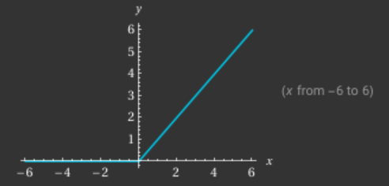
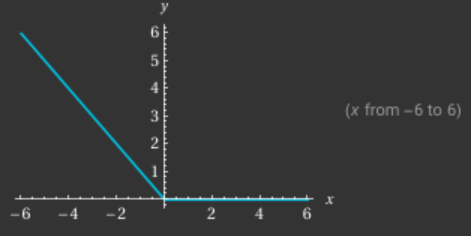
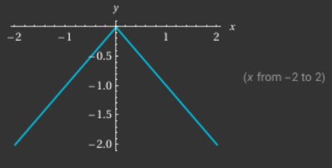
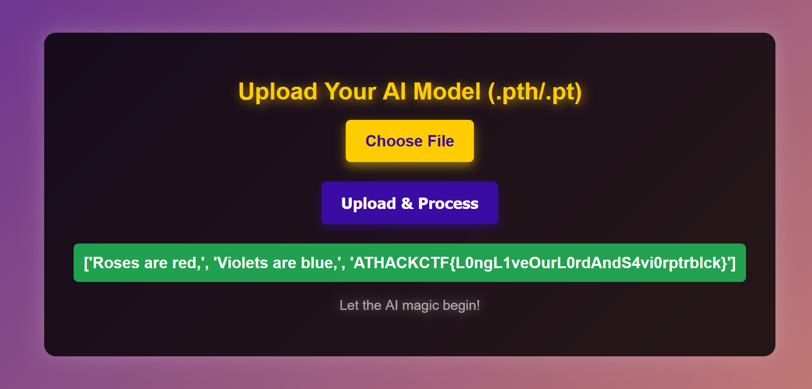

# @HackCTF 2025 - AI Leaky ReLU

Author: Hugo Kermabon-Bobinnec (also author of the chall)

Category: AI
Number of solves: 6 (regular track) / 3 (beginner track)
300 points

# 1. Context
The challenge is the only one in the AI category this year, and had only a few solves.
I would personally rank it intermediate for someone comfortable with ML and PyTorch, however because it is not directly security-related, I scored it pretty high to encourage people to try it out.

ReLU (rectified linear unit) is a type of activation function that's pretty popular in ML models. The function returns the input for positive input, and 0 for negative inputs.

### Background not required to solve the challenge
> With a lot of shortcuts:
>   - Because it does not respect the linearity condition f(ax) = a*f(x), the function enables models to learn about non-linear behaviours.
>   - ReLU introduce a vanishing gradient problem: if a negative input is passed to ReLU, it's output will be 0, and chaining layers of ReLUs would cause early layers to get "stuck" in the 0 state, unable to learn anything.
>   - Leaky ReLU were intended to solve that issue by still allowing negative output to return a tad negative results, so that ReLU would not be immutable.
> In the context of this challenge, "Leaky" is a pun with the fact that the goal of the challenge is to "leak" the input of an online version of the model.

Participants are given `app.py`, `model.py`, and access to an actual deployment of the code.

# 2. Web App
Looking at `app.py`, we see that the Flask app accepts `.pt` or `.pth` files (which are PyTorch model's paramters dumps), loads them into a model `NeuralNetwork`.
Then it reads data from `flag.txt`, transforms them into ASCII char values, and centralize them around 0 (from [0:255] to [-127:127]).
The data is passed through the layers of the model, and output to the participant.


# 3. Model
The model is made of several layers with names like ReLU, ULeR, LURe, etc.
Only ReLU is a "real" function, the others functions just play with the name of Re (negative part) and LU (positive part) to build some weird variants of it (see a few function below).


ReLU:



ULeR ("opposite" of ReLU):



LUUL:




The architecture of the model has two path: one for "negative" inputs and one for "positive" input. Because there are some ReLU (or other non-linear functions) in the model, it is impossible to process both negative and positive inputs with the same model parameters (one of both will automatically turn into 0 at some point).

There are also some "linear" layers the same size of the input, that basically just multiply whatever comes in by the weight, and retuns the output. All the bias are set to 0, so there is no "offset" in the output.
A linear layer is interposed between two non-linear (e.g., ReLU) layers, like: input --> p_11 -> l_1 --> p_12; and the total sum of everything is summed.


These are the parameters that are loaded into the model and that the user can control. Since the goal is to leak the input of the model, the idea here is to choose the right weight so that a positive input (e.g. +100) will give +100 after going through the positive path, and give 0 after going through the negative path. Similarly, a input of -100 should return 0 after the positive path, and -100 after the negative path.

Overall, the goal is to choose the right weights to turns the model into the identity function.


# 4. Solving
The main idea is to manually go through all the layers, and try to understand which combination of weights would realize the identify function. This is a bit time consuming but can be done.

We can proceed first with a positive input path:
- we want the result of a positive input to be positive (because of the way the ReLU-like function work, the positive result has to be the input itself)
- we want the result of a negative to be 0 

However, because there are 6 layers to go through, and that all their results is summed, we have to be careful.
Let's first draw what the output of each individual layer is on the positive path:


Output table of functions:

|      |    Positive Input  |   Negative Input  |
| ---- | ------------------ | ----------------- |
| ReLU |    +               |   0               |
| ULeR |    0               |   +               |
| LURe |    -               |   0               |
| eRUL |    0               |   -               |
| ULLU |    +               |   +               |
| LUUL |    -               |   -               |
| ULUL |    -               |   +               |
| LULU |    +               |   -               |


The positive paths that we are hinted at (layers starting with "p") is:
```
LUUL    --> x (weight lin p1)  -->  LURe    --> p1
LUUL    --> x (weight lin p2)  -->	ULeR    --> p2
ULLU    --> x (weight lin p3)  -->	ReLU    --> p3
LURe    --> x (weight lin p4)  -->	ReLU    --> p4
ULLU    --> x (weight lin p5)  -->	eRUL    --> p5
ULLU    --> x (weight lin p6)  -->	ULeR    --> p6

Final output = sum(p1, ..., p6)
```

At that point, it's clear that we can play with the weight to be either -1 or +1, and hope to get the correct output. After trying a few combination of weights (there is only 2^6 of them), we find one that works:
```
# Positive path, Positive input
+1  --> LUUL    -->  (-1) --> x -1  --> (+1)  --> LURe    --> -1
+1  --> LUUL    -->  (-1) --> x +1  --> (-1)  --> ULeR    --> +1
+1  --> ULLU    -->  (+1) --> x +1  --> (+1)  --> ReLU    --> +1
+1  --> LURe    -->  (-1) --> x -1  --> (+1)  --> ReLU    --> +1
+1  --> ULLU    -->  (+1) --> x -1  --> (-1)  --> eRUL    --> -1
+1  --> ULLU    -->  (+1) --> x +1  --> (-1)  --> ULeR    --> 0

Final sum = -1+1+1+1-1+0 = +1 = input
```

Other combination also works, but for this particular one, we can also try it with a negative input, and see that the output is always 0:
```
# Positive path, Negative input
-1  --> LUUL    -->  (-1) --> x -1  --> (+1)  --> LURe    --> -1
-1  --> LUUL    -->  (-1) --> x +1  --> (-1)  --> ULeR    --> +1
-1  --> ULLU    -->  (+1) --> x +1  --> (+1)  --> ReLU    --> +1
-1  --> LURe    -->  (0)  --> x -1  --> (0)   --> ReLU    --> 0
-1  --> ULLU    -->  (+1) --> x -1  --> (-1)  --> eRUL    --> -1
-1  --> ULLU    -->  (+1) --> x +1  --> (-1)  --> ULeR    --> 0

Final sum = -1+1+1+0-1+0 = 0
```


We can do a similar thing for the negative path:
```
# Negative path, Negative input
-1  --> LUUL    -->  (-1) --> x -1  --> (+1)  --> ReLU    --> +1
-1  --> eRUL    -->  (-1) --> x +1  --> (-1)  --> ULeR    --> +1
-1  --> ULeR    -->  (+1) --> x -1  --> (-1)  --> eRUL    --> -1
-1  --> LUUL    -->  (-1) --> x -1  --> (+1)  --> LURe    --> -1
-1  --> eRUL    -->  (-1) --> x +1  --> (-1)  --> eRUL    --> -1
-1  --> ULeR    -->  (+1) --> x -1  --> (-1)  --> ReLU    --> 0

Final sum = +1+1-1-1-1+0 = -1 = input
```

and
```
# Negative path, Positive input
+1  --> LUUL    -->  (-1)   --> x -1  --> (+1) --> ReLU    --> +1
+1  --> eRUL    -->  (0)    --> x +1  --> (0)  --> ULeR    --> 0
+1  --> ULeR    -->  (0)    --> x -1  --> (0)  --> eRUL    --> 0
+1  --> LUUL    -->  (-1)   --> x -1  --> (+1) --> LURe    --> -1
+1  --> eRUL    -->  (0)    --> x +1  --> (0)  --> eRUL    --> 0
+1  --> ULeR    -->  (0)    --> x -1  --> (0)  --> ReLU    --> 0

Final sum = +1-1 = 0
```


So the final weight combinations are:
- Positive: -1, +1, +1, -1, -1, +1
- Negative: -1, +1, -1, -1, +1, -1

# 5. Building the final model paramters:
We first load the same model that was given, and set its weight manually. We have to use the torch.eye function to generate some identify matrices.
Finally we export the weight as a `.pth` file.

```
model = NeuralNetwork()

model.lin_p1.weight = torch.nn.Parameter(-1*torch.eye(INPUT_LENGTH,INPUT_LENGTH), requires_grad=False)
model.lin_p2.weight = torch.nn.Parameter(1*torch.eye(INPUT_LENGTH,INPUT_LENGTH), requires_grad=False)
model.lin_p3.weight = torch.nn.Parameter(1*torch.eye(INPUT_LENGTH,INPUT_LENGTH), requires_grad=False)
model.lin_p4.weight = torch.nn.Parameter(-1*torch.eye(INPUT_LENGTH,INPUT_LENGTH), requires_grad=False)
model.lin_p5.weight = torch.nn.Parameter(-1*torch.eye(INPUT_LENGTH,INPUT_LENGTH), requires_grad=False)
model.lin_p6.weight = torch.nn.Parameter(1*torch.eye(INPUT_LENGTH,INPUT_LENGTH), requires_grad=False)

model.lin_n1.weight = torch.nn.Parameter(-1*torch.eye(INPUT_LENGTH,INPUT_LENGTH), requires_grad=False)
model.lin_n2.weight = torch.nn.Parameter(1*torch.eye(INPUT_LENGTH,INPUT_LENGTH), requires_grad=False)
model.lin_n3.weight = torch.nn.Parameter(-1*torch.eye(INPUT_LENGTH,INPUT_LENGTH), requires_grad=False)
model.lin_n4.weight = torch.nn.Parameter(-1*torch.eye(INPUT_LENGTH,INPUT_LENGTH), requires_grad=False)
model.lin_n5.weight = torch.nn.Parameter(1*torch.eye(INPUT_LENGTH,INPUT_LENGTH), requires_grad=False)
model.lin_n6.weight = torch.nn.Parameter(-1*torch.eye(INPUT_LENGTH,INPUT_LENGTH), requires_grad=False)

torch.save(model.state_dict(), 'solve_weights.pth')
```


Uploading these weight on the inference website gives the flag:




The flag is a reference to the well-known @ptrblck (Piotr Bialecki), a NVIDIA engineer that is very active on PyTorch forums

